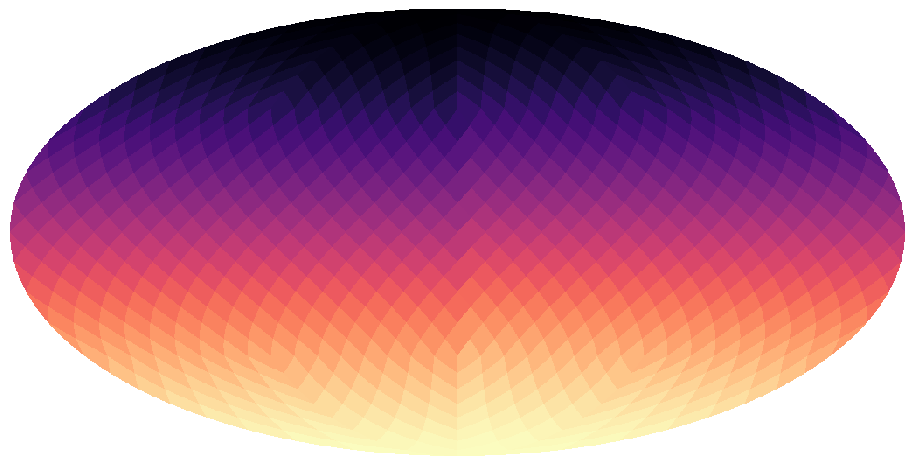
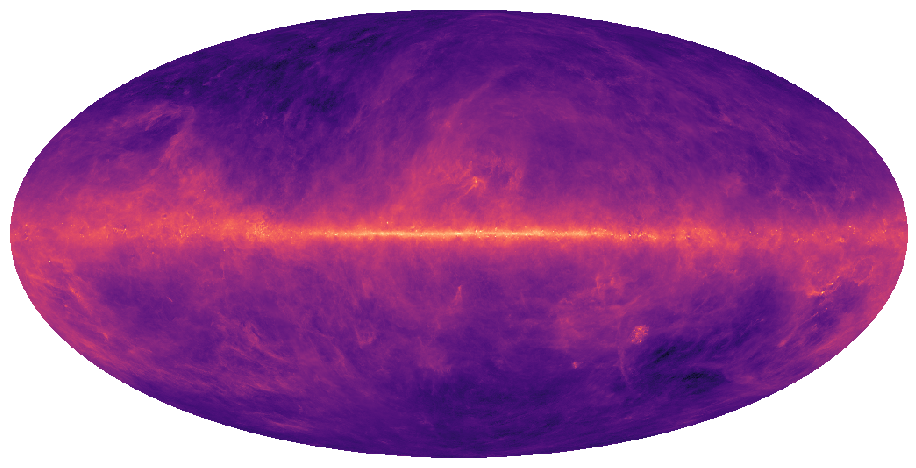
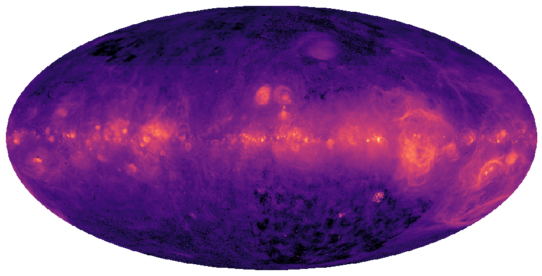

# LibHealpix.jl Documentation

LibHealpix.jl is a Julia wrapper of the Healpix library.

The Healpix library defines a pixelization of the sphere that is equal-area (each pixel covers the
same area as every other pixel) and isolatitude (pixels are arranged along rings of constant
latitude). Healpix was born from the need to rapidly compute angular power spectra for Cosmic
Microwave Background experiments (ie. WMAP and Planck) and is widely used in astronomy and
astrophysics.

## Ring or Nested?

Healpix maps come in two varieties: ring-ordered or nest-ordered.

Ring-ordered Healpix maps are represented using the [`RingHealpixMap`](@ref) type in LibHealpix.jl.
These maps have pixels arranged along rings of constant latitude, which allows the use of an FFT
while computing a spherical harmonic transform. If you intend to use spherical harmonic transforms
then you should use ring-ordered Healpix maps.

Nest-ordered Healpix maps are represented using the [`NestHealpixMap`](@ref) type in LibHealpix.jl.
These maps are ordered such that pixels that are spatially nearby are also nearby in memory. Many
pixel operations are much faster for nest-ordered Healpix maps than they are for ring-ordered
Healpix maps.

## Examples

Many astronomical maps are released as Healpix images. The following two maps show thermal dust and
H-alpha emission respectively. To first order, dust traces the interstellar gas density, so bright
regions in this map correspond to dense regions of the interstellar medium. On the other hand
H-alpha emission traces ionized gas in the interstellar medium. These ionized regions tend to be
sites of active star formation.

**Dust**

**H-alpha**

